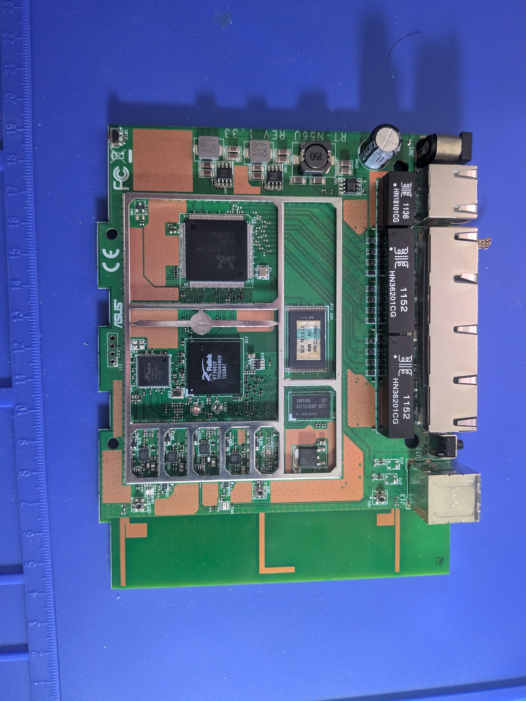
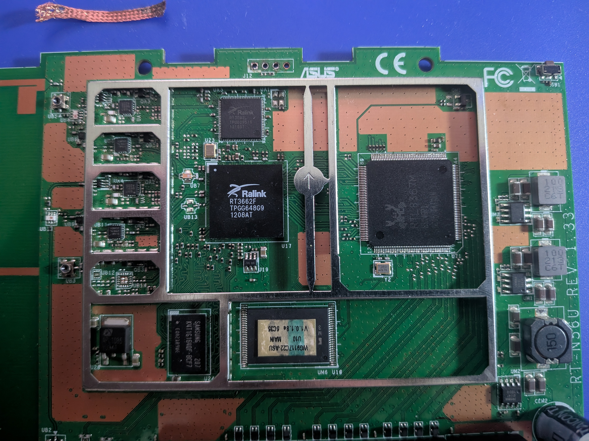
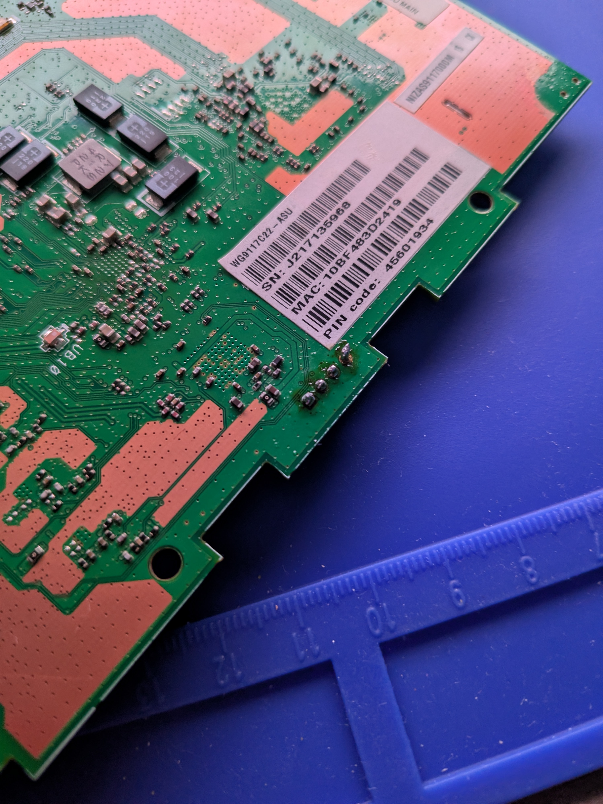
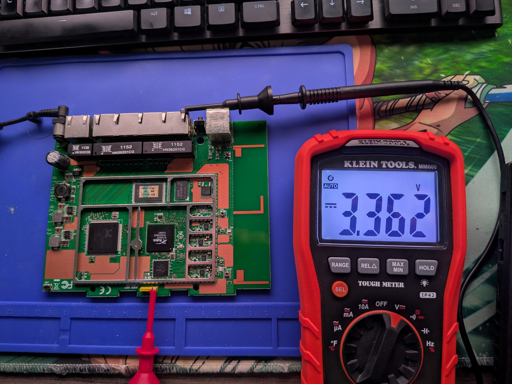
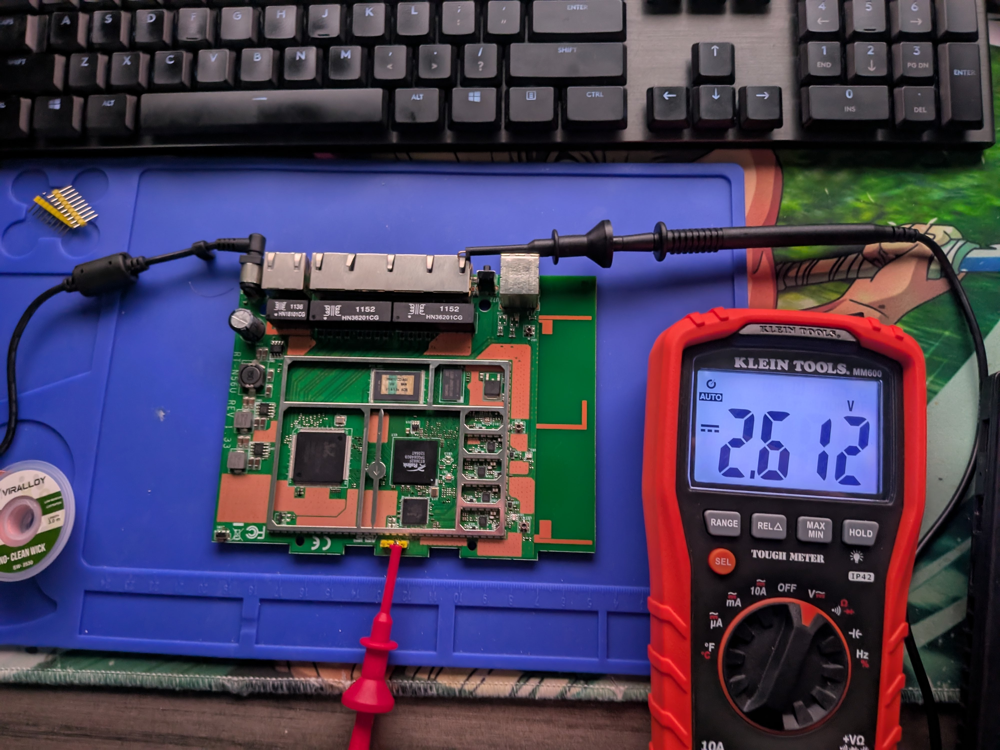
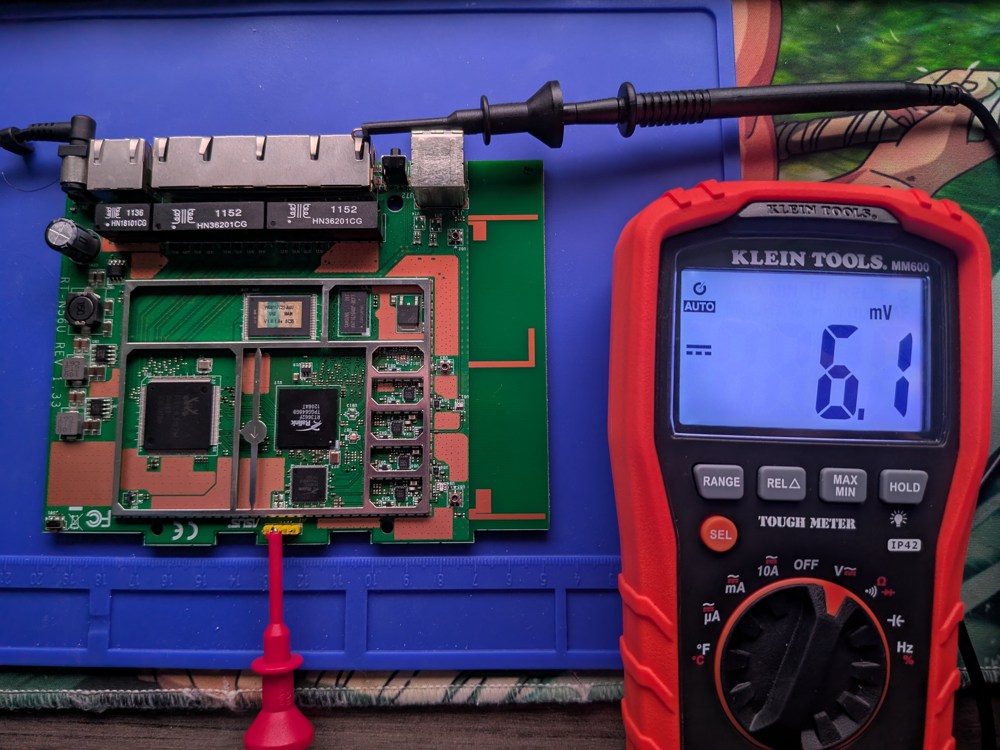
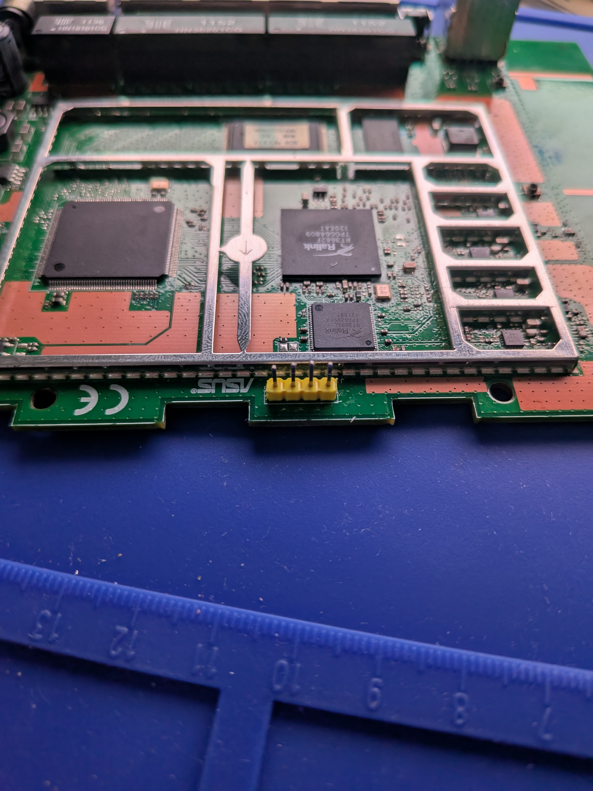
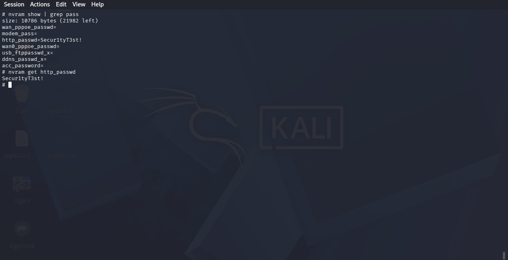

# ASUS RT-N56U: Hardware Debug & Embedded Linux Triage

## Overview
A hardware assessment and serial console triage of an ASUS RT-N56U dual-band router (Rev 1.33). I mapped the unpopulated UART pinout using a digital multimeter, soldered a 4-pin male header to the PCB, intercepted the U-Boot bootloader, gained an unauthenticated BusyBox root shell, and extracted cleartext administrative credentials directly from non-volatile flash memory (NVRAM)

---

## Table of Contents
* [Hardware Specifications](#hardware-specifications)
* [1. UART Pinout Discovery & Soldering](#1-uart-pinout-discovery--soldering)
  * [Multimeter Signal Probing](#multimeter-signal-probing)
  * [Header Soldering](#header-soldering)
* [2. Bootloader Interception & Root Shell](#2-bootloader-interception--root-shell)
  * [U-Boot CLI Access](#u-boot-cli-access)
  * [Unauthenticated Root Console](#unauthenticated-root-console)
* [3. Live System & Flash Storage Triage](#3-live-system--flash-storage-triage)
  * [System Architecture](#system-architecture)
  * [Flash Partition Layout (MTD)](#flash-partition-layout-mtd)
  * [Running Services & Web Endpoints](#running-services--web-endpoints)
* [4. Security Findings](#4-security-findings)
  * [Finding 1: Insecure Credential Storage in NVRAM (CWE-312)](#finding-1-insecure-credential-storage-in-nvram-cwe-312)
  * [Finding 2: Unauthenticated Hardware Debug Interface (CWE-1188)](#finding-2-unauthenticated-hardware-debug-interface-cwe-1188)
* [5. Remediation Recommendations](#5-remediation-recommendations)

---

## Hardware Specifications

| Component | Part Number | Package | Description |
| :--- | :--- | :--- | :--- |
| **System on Chip (SoC)** | Ralink RT3662F | BGA | 500 MHz MIPS 74Kc processor with integrated Wi-Fi MAC/baseband |
| **RAM** | Samsung K4T1G164QF-BCF7 | 84-ball FBGA | 128MB (1Gb) DDR2 SDRAM |
| **Flash Memory** | TSOP-48 Parallel NOR Flash (U10) | TSOP-48 | 8MB Parallel Flash (Firmware V1.0.1.8e) |
| **Gigabit Switch** | Realtek RTL8367M | 128-pin PQFP | 5-Port Gigabit Ethernet switch controller |
| **Secondary Radio** | Ralink RT3092L | QFN | 2T2R 802.11n 2.4 GHz transceiver |

  
  
  

---

## 1. UART Pinout Discovery & Soldering

I located an unpopulated 4-pin through-hole header labeled **J12** along the top edge of the PCB[cite: 1].

### Multimeter Signal Probing
I connected the ground lead of my Klein Tools MM600 multimeter to the RJ-45 Ethernet shielding ground plane and probed each pin during power-on[cite: 1, 3]:

| J12 Pin | Physical Position | Measured Voltage | Identified Function | Connection to CP2102 |
| :--- | :--- | :--- | :--- | :--- |
| **Pin 1** | Far Right | `3.362 V` (Steady DC) | VCC (Power Rail) | *Left Disconnected* |
| **Pin 2** | Middle Right | `2.612 V` (Active Pulses) | Router TX (Transmit) | **Adapter RXD** |
| **Pin 3** | Middle Left | `6.1 mV` (Logic Low) | Router RX (Receive) | **Adapter TXD** |
| **Pin 4** | Far Left | `0.000 V` (Continuity to Shield) | GND (Ground) | **Adapter GND** |

  
  
  

### Header Soldering
To make testing reliable and avoid loose connections, I soldered a yellow 4-pin 2.54mm male header strip into J12[cite: 1].



---

## 2. Bootloader Interception & Root Shell

I hooked up a CP2102 USB-to-UART bridge (Router TX to Adapter RX, Router RX to Adapter TX, GND to GND) and connected at **57,600 baud (8-N-1)** using `picocom`[cite: 1]:

```text
picocom -b 57600 /dev/ttyUSB0
```

### U-Boot CLI Access
During the initial boot countdown, selecting option **4** interrupted standard execution and dropped directly into the interactive U-Boot CLI (`RT3883 #`):

```text
Please choose the operation: 
   1: System Load Linux to SDRAM via TFTP. 
   2: System Load Boot Loader to SDRAM via TFTP. 
   3: System Boot Linux from Flash. 
   4: System Enter Boot Command Line Interface.
```

Running `printenv` dumped the environment variables, showing the kernel flash start address (`kernel_addr=BFC40000`) and the default IP configuration (`192.168.1.1`).


### Unauthenticated Root Console
Allowing the boot sequence to proceed initialized Linux kernel 2.6.21 and spawned a BusyBox `ash` shell[cite: 1]. The device dropped directly into an interactive root prompt (`#`) with UID 0 privileges without requesting login credentials[cite: 1].


---

## 3. Live System & Flash Storage Triage

With active root access on the serial line, I audited the running system, flash partition map, and active network services[cite: 1].

### System Architecture
```text
uname -a
cat /proc/cpuinfo
```
The router runs Linux kernel 2.6.21 on a 32-bit Ralink MIPS 74K V4.12 processor.


### Flash Partition Layout (MTD)
Checking `/proc/mtd` mapped the physical layout of the 8MB parallel flash chip[cite: 1]:

```text
cat /proc/mtd
```

| Device | Size | Erase Size | Partition Name | Purpose |
| :--- | :--- | :--- | :--- | :--- |
| `mtd0` | `0x00030000` (192 KB) | `0x00010000` (64 KB) | `"Bootloader"` | U-Boot bootloader binary |
| `mtd1` | `0x00010000` (64 KB)  | `0x00010000` (64 KB) | `"Config"`     | NVRAM persistent configuration block |
| `mtd2` | `0x00010000` (64 KB)  | `0x00010000` (64 KB) | `"Factory"`    | Factory calibration data and MAC addresses |
| `mtd3` | `0x007b0000` (~7.7 MB) | `0x00010000` (64 KB) | `"Kernel"`     | Linux kernel combined with SquashFS RootFS[cite: 1] |


### Running Services & Web Endpoints
Running `ps` enumerated active background daemons[cite: 1]:
* `/usr/sbin/infosvr`: ASUS network discovery service listening on `br0`
* `httpd`: Embedded web management server[cite: 1]
* `/sbin/wanduck`: ASUS WAN connection monitor
* `upnpd`: UPnP discovery daemon
* `dnsmasq`: DHCP and DNS relay

Listing `/www` displayed all web assets, JavaScript handlers, and ASP/CGI scripts used by the web management interface[cite: 1]:

```text
ls -C /www
```

  
  

---

## 4. Security Findings

### Finding 1: Insecure Credential Storage in NVRAM (CWE-312)
* **Severity:** High
* **Attack Vector:** Local Memory / Flash Storage
* **Description:** Administrative credentials for the web interface are stored in cleartext within non-volatile flash memory (NVRAM).
* **Proof of Concept:**  
  Querying the `http_passwd` key from the root shell returned the active management password in plain text:
  ```text
  # nvram show | grep pass
  http_passwd=Secur1tyT3st!

  # nvram get http_passwd
  Secur1tyT3st!
  ```
  Updating the password via the administrative web interface commits the new ASCII string directly to flash without cryptographic hashing or salting.



### Finding 2: Unauthenticated Hardware Debug Interface (CWE-1188)
* **Severity:** High
* **Attack Vector:** Physical / Local UART Header (`J12`)[cite: 1]
* **Description:** The PCB exposes an active 4-pin UART serial interface in production[cite: 1]. Connecting to the port grants unauthenticated root shell access and full control over the U-Boot bootloader without requiring login credentials[cite: 1].

---

## 5. Remediation Recommendations

1. **Hash Administrative Passwords at Rest:** Transition from cleartext NVRAM variables to salted, one-way cryptographic hashes (such as bcrypt, PBKDF2, or SHA-512) stored in `/etc/shadow` on a persistent partition[cite: 1].
2. **Disable Serial Console Logins in Production:** Update `/etc/inittab` to prevent unauthenticated `ash` shells from spawning automatically on `ttyS0` in release builds, or require root authentication prior to granting terminal access.
3. **Depopulate Debug Test Points:** Remove silk screen markings and unpopulated through-hole pin headers for UART and JTAG on production PCB revisions to raise the bar against local bus attacks.